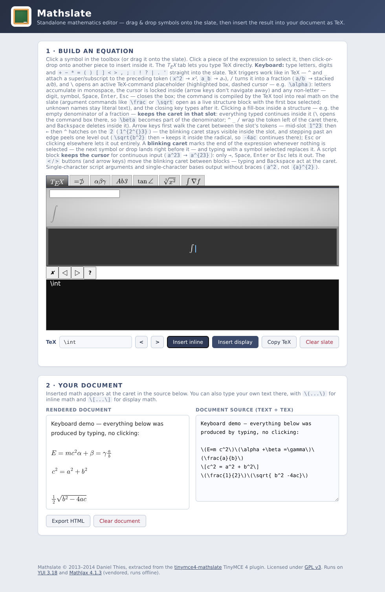

# Mathslate — Standalone Math Editor

The [Mathslate](https://github.com/dthies/tinymce4-mathslate) drag-and-drop
mathematics editor, **extracted from its TinyMCE 4 plugin shell** so it runs as
a self-contained application — no TinyMCE, no Moodle, no build step, no
server-side anything.

Drag symbols from the toolbox onto the slate (or click to append, click pieces
of the expression to select/rearrange them), **or just type** — the basic
character set is entered straight from the keyboard: letters, digits and
`+ − * = ( ) [ ] < > , ; : ! ? | . '`, with `Backspace`/`Del` deleting
(selection first; then `Backspace` eats the token **left** of the caret,
`Del` the token to its **right** — never the same key) and `Esc` deselecting.
Four keys are **TeX triggers**, not literals, binding or opening structures
exactly like in TeX:

| Key | Behavior | Example |
| --- | --- | --- |
| `^` | superscript of the preceding token; the cursor **locks inside** the script block and characters accumulate (`a^23` → `a^{23}`) until `→`/`Space`/`Enter`/`Esc` lets it out; a single-char script — and single-char base — is emitted **without braces** | `x^2` → `x^2` (press `→` to leave); `y+1^2` → `y+1^2` (only the `1` binds) |
| `_` | subscript ditto | `a_bc` → `a_{bc}` |
| `/` | fraction of the preceding token, one token fills the denominator | `a/b` → `\frac{a}{b}`; `1/2/3` → `\frac{\frac{1}{2}}{3}` |
| `\` | opens an **active TeX-command placeholder** (see below — including *inside* a focused structure slot); on close the name is **compiled by the toolbox TeX tool** into real math | `\alpha2` → `\alpha 2`, `\gamma` → `\gamma` — the slate then shows a real γ glyph |

With a slate block **selected** (clicked), `^`, `_` and `/` wrap the
*selection* where it stands instead of the last block: `12`, click the
`1`, `^` gives `1^{}2` and the argument owns the cursor (`34` fills it in
place). Selecting a *part* of a structure (a fraction's numerator) wraps
its whole top-level block (`\frac{1}{2}` → `{\frac{1}{2}}^{}`), with the
fill landing in the fresh argument box — never in the base's own boxes.
Clearing the slate also drops any armed/selected box synchronously, so
typing immediately after **Clear slate** cannot fall into a ghost
placeholder and vanish.

Script blocks **keep the cursor**: after the first fill the block stays
"active" (green lock glow, caret anchored inside as `a^{2|}`) and every
further character accumulates in the block — exactly the continuous input
TeX's braces group. Only an explicit navigation command lets it out: `→`
(or the `>` button) at the block's end, `Space`, `Enter`, `Esc`, or a
click elsewhere on the slate. An arrow pressed while the fresh block is
still EMPTY (armed box, nothing typed yet) steps straight back out and
re-anchors the caret at the top level: `→` parks it right after the
still-empty block (`e^` `→` `x` → `e^{}x`), `←` parks it before the
block (`e^` `←` `x` → `xe^{}`). `←`/`→` (and the `<`/`>` buttons) step the
caret **between the block's tokens** while it is locked; `Backspace`
inside deletes the block's last token and collapses an emptied block back
to its bare base. The `\` placeholder is a little three-state box of its own:

1. **Activation** — typing `\` inserts a placeholder container showing a
   monospace `\` with the cursor locked inside it: arrow keys (and
   Home/End/PgUp/PgDn) are captured, so you cannot navigate away until a
   closing condition is met.
2. **Accumulation** — the open box keeps a distinct active wrapper: the
   macro text is highlighted, the cursor box carries a dashed outline, and
   the slate shows a lock glow. Only letters `[a-zA-Z]` accumulate, as one
   `mtext` token with `mathvariant="monospace"`.
3. **Closing** — any non-letter (digit, symbol, `Space`, `Enter`, `Esc`)
   drops the active wrapper and **converts the name into real math**: the
   string is handed to the very pipeline the toolbox **TeX** tab uses
   (MathJax `root.toMathML` → Mathslate's MathML-to-snippet parser), so
   the box is replaced by proper parsed nodes — `\alpha` leaves a real
   `<mi>α</mi>` on the slate, not a monospace text token. Commands that
   take arguments — `\frac`, `\dfrac`, `\tfrac`, `\binom`, `\sqrt` —
   open as a **live structure block** instead: the toolbox template with
   empty boxes (e.g. a fraction with numerator + denominator), the first
   box pre-selected so typing fills it right away — and the slot focus
   keeps the caret inside, so digits accumulate (`\\sqrt` `Enter` `12` →
   `\\sqrt{12}`); click another box to fill it, or step out with an
   arrow. The closing
   character is processed strictly after the conversion: `\alpha^2` ends
   as α² stacked (`{\alpha}^{2}`), and `\frac` + `Enter` + `12` + click
   + `3` gives `\frac{12}{3}`. The converted node's TeX is wrapped
   with a trailing (inert) space, so no macro-name merging either. A name
   the TeX parser rejects (say `\zzzz`) degrades to the literal monospace
   token instead of vanishing. `Backspace` shortens the name, and backs
   out of an empty box entirely.

**Slot focus: typing inside a structure stays inside it.** Clicking a
fill-box *inside* a structure (a fraction's empty denominator, say) plants
a persistent **slot focus**: filling the box keeps the caret in that slot,
and everything typed afterwards continues inside it —

- `\\` opens the command box **inside the slot** (`b` then `\\beta` →
  `b\\beta` — previously the backslash silently exited the fraction). The
  same holds while a top-level script block is locked: `e^i` then `\\` opens
  the box inside the superscript (`e^{i\\pi}`);
- plain characters and delimiters like `+` continue at the slot's end
  (`\\frac` `Enter` `1`, click the denominator, `\\beta` `Enter` `+` →
  `\\frac{1}{\\beta+}`, even when the `+` is typed the instant the
  conversion lands);
- the **blinking caret stays visible inside the slot**, hugging the token
  (or trailing box) at the intra-slot position — typing never leaves the
  caret in limbo (`\\sqrt` `Space` `b^2` keeps the caret inside the
  superscript, ready for more);
- arrow keys first move an **intra-slot caret** between the slot's tokens:
  characters insert exactly at it, `Backspace` deletes the token to its
  left and `Del` the token to its right (the caret keeps its place); stepping past an edge peels exactly **one nesting level** — a slot
  inside another structure's slot hands the caret to the enclosing slot,
  parked beside the structure it just left (`\\sqrt{b^{2|}}` →
  `\\sqrt{b^2|}`, so `-` continues *inside* the radical: `\\sqrt{b^2-}`) —
  and only a slot hanging directly off a top-level block releases the
  caret to the slate beside that block;
- `^`, `_`, `/` wrap the token **left of the intra-slot caret** into a
  script or fraction right there, the argument box arms, and input keeps
  accumulating inside the argument (`a` `^` `23` → `a^{23}` without leaving
  the fraction). The same holds while a top-level script block is locked:
  `1^23` then `←` then `^` hatches ON the `2` in place (`1^{2^{}3}`) —
  a trigger with the caret at the slot's *end* keeps the classic
  newest-wins whole-block wrap (`1/2/3` → `\frac{\frac{1}{2}}{3}`);
- `Backspace` deletes inside the slot and, at an empty slot (or at the
  slot's left edge), steps out instead of eating the structure
  (`Del` at the slot's right edge is simply a no-op — the exit stays
  Backspace's);
- exits are always explicit: `Esc`, an arrow step past an edge, or
  clicking other content — and every exit **closes the slot's placeholder
  box** behind it: the trailing box only ever was the caret's socket (and
  the next fill's click target), so `\\sqrt{b^2}` then `→` leaves a clean
  `b^2` with no stray box behind the `2`. A slot holding nothing but the
  box keeps it — that one is the structure's own empty-argument affordance
  (`\\sqrt{}`, `e^{}`).

**Focus discipline.** The slate owns DOM focus from the moment the app
opens — literally: the slate canvas is programmatically focusable
(`tabindex="-1"`, so no new tab stop) and `document.activeElement` is the
canvas at launch, not the page body and not the TeX tool's field — so
typing starts working immediately with no click; and a click anywhere in
the editor reclaims DOM focus **for the slate** from whatever form control
held it (the TeX field, the document textarea — even on browsers that
keep inputs focused across outside clicks), so keystrokes always follow
the visible caret. The blinking caret is the app's focus indicator, so
the browser's default focus outline on the workspace is suppressed. On
the empty slate the caret hugs the decoy box absolutely (MathJax typesets
the empty slate's container block-level, so an in-flow caret would wrap
to a fresh line below the slate — visibly centered inside the black
preview panel while the □ sits alone at the canvas's bottom left).

The focus lives as a pure closure address (owning top-level block + JSON
path into the slot's content array + intra-slot token index + the trailing
box's pre-order blank index, the caret's DOM socket) — no DOM markers
involved in routing — so MathJax 4's asynchronous re-renders can never
strand the cursor or bounce it out of the fraction. The arming click that
opens a fresh argument box now also holds the input queue until its
selection marker actually lands, so even a zero-delay fast typist cannot
have a fill splice into the wrong slot while the marker is in flight. Structure boxes the app arms
*for you* (a macro-converted `\\sqrt`'s radicand, `\\frac`'s numerator)
plant the slot focus on their first native fill, so continuation typing
stays inside; only the script-trigger boxes (`^`/`_` at top level) keep
the classic one-token-per-box release (their own lock machinery owns
accumulation there).

**Fraction navigation.** Inside a fraction the arrows climb between the
two slots instead of stepping out early: `←` from the denominator's
start jumps straight up to the numerator's **end**, and `→` from the
numerator's end drops back to the denominator's start. Repeated `←`
then walks the numerator left token by token, and one final `←` past
its start exits the fraction to the left — while `→` past the
denominator's end exits to the right. This holds both while a typed `/`
block is still locked and after clicking into a box of a finished
fraction. (A bare base numerator is wrapped in an invisible `mrow` so
the caret has a socket — TeX and rendering are unchanged.)

**Placeholder-first insertion.** Dropping a structure onto the slate
from the toolbox — by click or by drag — puts the cursor straight into
the structure's **first** empty placeholder box instead of parking it at
the block's end, so a `\frac{□}{□}` fills numerator-then-denominator
without any clicking between. Typed `\frac`-style commands that need
arguments behave the same way (and always did).

**Matrix tool, any size.** The toolbox's matrix button asks for its
dimensions first — any **1×1 to 10×10** grid — and for its **brackets**:
bare, `( )`, `[ ]`, `{ }`, `| |` or `‖ ‖`. The slate renders the chosen
delimiters with the matrix, while the TeX output stays canonical amsmath:
bare grids keep the legacy `\matrix{…}` form and wrapped ones emit the
environment (`\begin{pmatrix}…\end{pmatrix}` — the `\bmatrix`-style
plain macros exist in neither MathJax 4 nor modern amsmath). The insert
then drops the cursor into the first cell, so `Tab` fills the matrix
cell by cell, row by row (`Shift+Tab` steps back). Size and brackets are
remembered for the session: the next matrix click defaults to them, and
*dragging* the tool onto the slate inserts at the remembered setting
straight away (a drag cannot pause for a prompt mid-gesture). Typing
`\matrix{a&b\\c&d}` into the TeX tab is
not affected — it compiles as before.

**Tab navigation.** `Tab` moves the cursor to the next empty box in the
expression — placeholder arguments *and* the slots' own trailing □
boxes — in document order, wrapping around at the end; `Shift+Tab`
walks the same cycle backwards (from a free caret it starts at the box
nearest the caret). With a single empty box it is a no-op, and with none
it quietly leaves the current lock or caret untouched.

**The blinking caret.** Whenever nothing on the slate is selected and the
editor has focus, a blinking caret marks the insertion point. It parks at
the end of the expression by default, and the **`<` / `>` buttons** (next
to the TeX read-out — or the `←`/`→` arrow keys) step it one block at a
time: mid-expression it anchors itself right beside the block on its right,
and **typed characters splice in at the caret** while `Backspace` deletes
the block to its left and `Del` the block to its right. Inside a locked script block the caret lives
between the block's tokens. It hides on selection, while a macro box is
open (it owns its own cursor), and when focus moves to a text control or
out of the window. With a snippet selected, typed characters **replace** it
entirely and the caret returns at the end; the canvas is a drop zone and
the caret glows while a drag hovers it.
**Backspace/Delete audit:** history-back navigation cannot fire — every
Backspace or Delete keydown outside a text control is intercepted
(`preventDefault`) and routed: delete the selection, back out of a macro
or script box (`Backspace` only — a macro name's text caret sits at its
end, so `Del` is a no-op there), delete the block left of a mid-slate
caret (`Backspace`) or right of it (`Del`), or drop the most recent
top-level block (`Backspace` at the end; `Del` there is a no-op, so the
two keys are never aliases). Inside a locked script block the same split
applies between the block's tokens, with one deliberate asymmetry:
`Backspace` on an emptied block collapses it back to its bare base while
`Del` leaves block exits alone. (Modern browsers dropped the Backspace-shortcut years ago;
the interception is belt-and-braces on top.)

Characters you type while MathJax re-renders are queued, so fast and slow
typing always produce the same slate, and macro mode is state-machine driven
so it cannot be derailed by renderer stalls. In the TeX output,
braces are stripped around single-character script arguments **and** around
standalone single-character bases (`{x}^{2}` displays as `x^2`,
`{a}^{2}+{b}^{2}` as `a^2+b^2`); multi-character arguments keep theirs
(`e^{2x}`), and a macro base keeps its braces (`{\alpha}^2`) so the command
can never bleed into a following character. The **TeX** tab still accepts
raw TeX. **Insert** commits the equation into the built-in document pane as
`\( ... \)` / `\[ ... \]` TeX and resets the slate, so
`type → insert → type → insert` never needs a click — or copy the TeX /
export the document as a stand-alone HTML file.



## Run it

The app is plain HTML/CSS/JS. Two ways to use it:

* **Just open `index.html` in a browser.** The tool configuration is inlined
  (`js/config.js`), so no XHR is needed and `file://` works.
* Or serve it (nicer, avoids any browser `file://` quirks):

  ```sh
  cd mathslate-standalone
  python3 -m http.server 8000
  # → http://localhost:8000
  ```

No internet connection is needed: every runtime dependency is **vendored**
under `vendor/` — YUI 3.18.1 (the npm build tree plus its TabView skin and
a synthesized `assets/skins/sam/sprite.png`; the 41 rollup files the loader
requests are regenerated as concatenations of their submodules, marked in
each file's header), MathJax 4.1.3 (`tex-mml-chtml.js`, its SRE speech
worker and the NewCM webfont packages, all resolved through
`MathJax.loader.paths.fonts`). (The original plugin used Yahoo's YUI CDN,
which no longer exists; an earlier revision of this standalone pulled YUI
from cdnjs and MathJax from jsDelivr.)

## What was changed in the extraction

The editor core (`js/mathslate/*.js`, `css/styles.css`, `help.html`,
`config.json`, `js/strings.js`) is verbatim from
`plugins/mathslate` of tinymce4-mathslate, except:

| File | Change |
| --- | --- |
| `js/mathslate/editor.js` | Accepts the tool config as a JS object (`M.tinymce_mathslate.configJSON` from `js/config.js`) in addition to a URL fetched with `Y.io`. Enables `file://` use. Also, toolbox tool *labels* render each blank marker as the same visual box the slate uses (`□`, U+25FB) instead of a literal `[]` pair — brackets are functional math symbols (intervals, matrices), the box is the unified fill-in affordance; the stored tool json keeps the raw marker, so dropping a tool still lands a live blank on the slate (marked `Standalone app (documented patch)`). |
| `js/mathslate/mathjaxeditor.js` | Help button glyph `&#xE47C;` (a Moodle icon-font glyph) replaced with a plain `?`. For the MathJax 4 port: when a snippet is selected while its canvas node has not rendered yet (v4 typesets asynchronously), the selection-highlight code guards the missing node instead of throwing (marked `MathJax 4 port (documented patch)`). And the FIRST canvas render requests inline math instead of `display="block"` (under the app's `displayAlign:'left'` config a display-mode first render left-justified the empty slate's placeholder box at the canvas's bottom-left until the first keystroke re-rendered it centred; marked `Standalone app (documented patch)`). After a toolbox drag-drop insert, the drop handler additionally calls the host app's `window.__mathslateAfterToolInsert` hook so the inserted structure's first placeholder box can be focused as the cursor (no-op when the host does not listen; marked `Standalone app (documented patch)`). The same drop handler first offers the host a `window.__mathslateDropJSON` substitution hook — Mathslate's matrix tool uses it to insert workspace drags at the grid size and brackets last chosen in its dimension dialog, since a drag cannot pause for a prompt mid-gesture (marked `Standalone app (documented patch)`). Also, `output('JSON')` cleans the slate by DEEP COPY instead of mutating the live tree: the upstream code deleted ids and swapped blanks for `'[]'` strings on the shared objects, which silently poisoned undo/redo snapshots — a later undo restored the raw markers as literal content (`\frac{1}{[]}` in the buffer, then propagating; marked `Standalone app (documented patch)`). |
| `js/mathslate/textool.js` | The TeX tool's input no longer takes DOM focus at construction: the standalone app wants the *workspace* focused at launch, so the first keystrokes land on the slate (marked `Standalone app (documented patch)`). |
| `js/mathslate/snippeteditor.js` | The `output()`/`preview()` serializers never emit a bare `'[]'` element: inside a snippet tree that string is only ever the internal blank marker, so it must stay a render-level box and can never leak into the TeX text (marked `Standalone app (documented patch)`). |
| `plugin.js` / `mathslate.html` / `yui/build/*dialogue*` | **Dropped.** The TinyMCE plugin wrapper and Moodle dialogue module are replaced by `js/app.js`, which owns the "document" and the Insert/Copy/Clear actions that used to live on TinyMCE's dialogue buttons. |
| `config.json` / `js/config.js` | The Latin-alphabet tab gains two quick-access rows alongside its lowercase/uppercase/digits rows: calligraphic script `\mathcal A`–`\mathcal Z` and Fraktur `\mathfrak A`–`\mathfrak Z` (26 + 26 single-glyph tools, built exactly like MathJax 4's own TeX output for those macros — `\mathcal{A}`'s `<mi>` carries `data-mjx-variant="-tex-calligraphic"` on top of `mathvariant="script"` (without the internal variant the canvas shows the Unicode script alphabet, not the classic calligraphic one), `\mathfrak{A}`'s just `mathvariant="fraktur"` — so the canvas, the label and the TeX read-out all agree with the real macros). Also fixed two upstream-latent tools: the total/partial derivative buttons wrapped their glyph in a one-element array (`["mi",{},["d"]]`, `["mi",{},["∂"]]`) that `toMathML` silently drops, so the buttons rendered as empty `<mjx-mi>` and looked exactly like the plain fraction — and the slate lost the `d`/`∂` on insertion too; the glyphs are plain string content now. `js/config.js` is the inlined runtime copy of `config.json`; both list the tools identically. |
| `index.html`, `js/app.js`, `js/config.js`, `css/app.css`, `js/mathjax4-shim.js` | **New.** App shell, document model (source textarea + MathJax-rendered pane), clipboard/export helpers, keyboard entry of the literal character set, inlined config, and the MathJax v2-to-v4 API shim. |

Also: YUI loads from `vendor/yui/` with `combine:false` and
`fetchCSS:false` (the TabView skin is linked by hand), and MathJax is
pinned to `4.1.3` under `vendor/mathjax/`.

## How it works

```
index.html
 ├─ YUI 3.18.1 (vendor/yui) ─ loader pulls tabview / dd / io / json … modules
 ├─ MathJax 4.1.3 (vendor/mathjax, tex-mml-chtml; fonts in vendor/fonts)
 ├─ js/mathjax4-shim.js  the v2 API (Hub/Queue/Text/addElement, math/tex
 │                        scripts, Callback) re-expressed over MathJax 4
 ├─ js/strings.js        M.util.get_string() shim (was: Moodle lang strings)
 ├─ js/config.js         tool palette, inlined from config.json
 ├─ js/mathslate/        the four Mathslate YUI modules
 │    snippeteditor.js     mSlots: expression model, undo/redo, TeX output
 │    mathjaxeditor.js     the slate: canvas, drag&drop, toolbar
 │    editor.js            toolbox tabs, TeX tool, wiring
 │    textool.js           type-TeX-to-snippet tool
 └─ js/app.js            standalone glue: document panes, insert/copy/export
```

The TinyMCE bridge — `top.tinymce.activeEditor.windowManager.getParams()` in
the original dialogue page — is gone; `js/app.js` reads
`editor.mje.output('tex')` directly and inserts the wrapped TeX at the caret in
the document source, which a MathJax-typeset pane renders live.

## The MathJax 4 port

Upstream Mathslate was written against the MathJax 2 API. The port keeps the
four core modules essentially verbatim and adapts around them:

* **Dependencies & config** — `mathjax@4.1.3/tex-mml-chtml.js` (vendored;
  v4 ships no `es5/` or `-full` variants) replaces the cdnjs 2.7.9 build,
  and the v2 `MathJax.Hub.Config({...})`
  call becomes an inline v4 options object set before the bundle loads
  (`tex.inlineMath`/`displayMath` with the same `\( \)` / `\[ \]`
  delimiters + `processEscapes`, `options.skipHtmlTags` extended with
  `annotation`/`annotation-xml`, `chtml.displayAlign:'left'`,
  `displayIndent:'0'`, `chtml.linebreaks.inline:false` (v4 breaks inline
  math at operators by default; v2 never did — with it on, the
  fixed-width `=⊅` toolbox tab label wrapped a glyph below the tab
  strip), `startup.typeset:false`). Webfonts load from the
  vendored `@mathjax/mathjax-newcm-font@4.1.3` copy (`vendor/fonts/`).
  The port also exposed one content bug in the labels: the Calculus tab's
  `<mi>∇</mi>` picked up v4's italic nabla (v2's fonts had none to fall
  back to), so the label now sets `mathvariant="normal"`, matching the
  `\nabla` tool itself (and checked by the suite). And with label math no
  longer wrapped or shrunk, the fixed `3.25em` label width made `tan∠`
  protrude across the next tab — `css/app.css` sizes the tab labels to
  their content (`min-width: 3.25em`) instead.
* **`js/mathjax4-shim.js`** re-expresses the v2 surface the core codes to —
  `MathJax.Hub` (`Queue`, `getAllJax`, `Typeset`, `isQuiet`, config hooks),
  `Hub.Queue`'s `['Text', jax, …]` element renderer, `MathJax.HTML.addElement`,
  `MathJax.Callback`, and legacy `<script type="math/tex|mml">` elements —
  over the v4 component model (MathDocument/MathItem/`typesetPromise`), as a
  strictly-ordered FIFO whose drain is promise-aware. Two render-path
  behaviours are the secret sauce: **obsolete-render collapse** (when a newer
  canvas render is already queued, the stale `'Text'` render is skipped
  together with its paired shim-rebuild callback) so a fast typist never
  watches the slate flicker backwards, and **`Hub.isQuiet()`**, the only
  moment the preview DOM may be treated as current — every app-side
  DOM-reading poll gates on it. Emitted MathML is sanitized of v4's
  `data-*` attributes (the TeX tool's attribute parser expects v2-clean
  markup).
* **Rendering components** — v4 CHTML keeps MathML `id`/`class` attributes on
  its custom elements (`<mjx-mi id=… class=…>`), so the core's drag/drop
  shims and selection markers anchor exactly as they did on v2's spans;
  glyphs render as math-italic codepoints (e.g. `𝛼` U+1D6FC, not literal
  `α`), and unknown macros surface as red `<mtext>` just like v2's merror.
* **`js/app.js`** learned to never race the asynchronous typeset: the caret's
  block accounting is model-authoritative (`modelBlocks` maintained at every
  mutation, DOM re-read only while the queue is quiet), the selection marker
  is scrubbed synchronously around core mutations (a stale marker makes the
  core's own insert/delete calls silent no-ops), replace-on-selection splices
  by preview-row position (the core addMath+clear pair reads an id the
  synchronous rekey just invalidated), and armed-box fills drop the consumed
  box's marker at once — one token per box, deterministically.

## Verification

`tests/e2e.mjs` is a Playwright end-to-end test that boots the app over HTTP
and from `file://` in headless Chromium and exercises the full flow: toolbox
rendering (7 tabs / 199 tools), click-to-build (`+ − ± → "+-\pm "`), TeX
direct input, inline/display insertion, document typesetting, help, undo,
clear, HTML export and keyboard entry — literal characters, `^`/`_` script
triggers (`x^2` → a stacked `<msup>` shown braceless as `x^2`, cursor-lock
retention `a^23` → `a^{23}`, token binding `y+1^2` → `y+1^2`), the `/` fraction
trigger (`a/b` → `\frac{a}{b}`, nesting), the `\` TeX-command placeholder —
the three states above (active wrapper with dashed cursor
box + highlighted token, arrow-key lock, Space/Enter/symbol closing; on
close the name is parsed by the toolbox TeX tool into real math;
argument commands like `\frac`/`\sqrt` expand to a live structure
block with the first box selected; unknown names fall back to a
literal token) — the `\\`-inside-a-structure regression (open the command
box with a fraction's denominator selected; it must stay inside) — Backspace,
delete-a-selection, and no leakage from text fields — plus the caret
lifecycle (blink animation, end and mid-slate anchoring, show/hide on
selection and focus), the `<`/`>` navigation buttons and arrow-key stepping
(edits land AT the caret), script-block retention with its four explicit
exits (including the arrow over an armed-but-empty block: the caret
re-anchors at top level, `e^` `→` `x` → `e^{}x`), replace-on-selection
typing, the Backspace-no-navigation audit, and
the brace-stripping TeX rule (single-character script arguments and bases).
All 62 numbered steps are green under MathJax 4.1 (CHTML output) with no
console errors, stable across repeated consecutive runs. See
`tests/README.md`.

## License

Mathslate is copyright 2013–2014 Daniel Thies <dthies@ccal.edu>, licensed
under the GNU GPL v3 or later (see `LICENSE`). The same license applies to
this standalone extraction.
